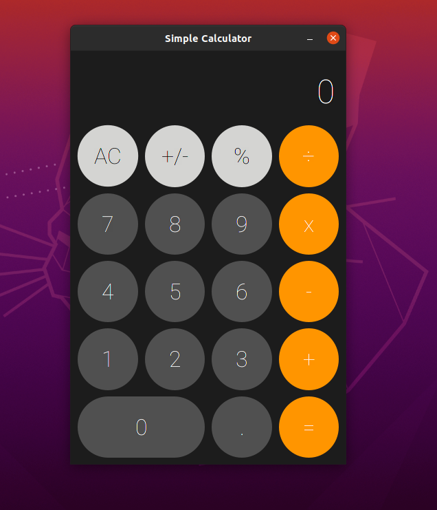

# Simple Calculator
A simple calculator with the most basic of features made with Java 11 and JavaFX.

## Development
The build tool is Maven and to build the package along with the cross-platform JAR, do `mvn package`.

## How To Use
Just download the JAR file on the releases page of the repository and run it on your own Java Virtual Machine. On Windows, if Java is installed properly, simply double clicking on the JAR file would run it.

## Features
This calculator application has a simple working GUI.
- Control with mouse or keyboard, whichever you fancy.
- Basic operations such as addition, subtraction, multiplication, and division.
- Clear all button which resets the calculator's state.
- Sign button which changes the sign of the number positive to negative and vice-versa.
- Rate button which changes the number to a rate.

## Possible Improvements
Currently the application doesn't limit the number of digits that can be entered, there may be issues that could arise because of that.

## Screenshot
